<div align="center">

**Building intelligent systems at the intersection of AI, blockchain, and sustainability.**
*Open-source tools that transform ESG compliance into automation.*

<br/>


</div>

---

## 🧠 Our Projects

<table>
<tr>
<td width="50%" valign="top">

### 🌱 CfoE — Carbon Footprint Optimization Engine
> Agentic ESG compliance system

- Supplier risk intelligence
- Blockchain audit trails
- AI-generated ESG reports


</td>
<td width="50%" valign="top">

### ⛓️ ChainVerify `Beta`
> Blockchain verification utilities

- Transaction anchoring
- Cryptographic hash verification


</td>
</tr>
<tr>
<td width="50%" valign="top">

### 🤖 AgentCore
> Reusable multi-agent orchestration

- Coordinator patterns
- HITL safety gates
- Deterministic scoring


</td>
<td width="50%" valign="top">

### 📊 ESG Dashboard `WIP`
> Real-time sustainability metrics

- Real-time emissions tracking
- Multi-supplier comparison
- WebSocket streaming


</td>
</tr>
<tr>
<td width="50%" valign="top">

### 🪙 CarbonToken `Beta`
> DeFi-powered carbon credits

- Carbon credit tokenization
- DeFi staking & rewards
- Marketplace integrations


</td>
<td width="50%" valign="top">

### 🔐 AuditVault `WIP`
> Encrypted audit infrastructure

- Encrypted audit delivery
- AES-256 security
- Agentic micro-payments


</td>
</tr>
</table>

---

## ⚙️ Tech Stack

<div align="center">


</div>

---

## 🔬 Research Focus

<div align="center">

| Domain | Intensity |
|--------|-----------|
| 🌍 ESG & Sustainability | `████████████████████` 90% |
| 🤖 Multi-Agent AI Systems | `████████████████████` 80% |
| ⛓️ Blockchain / Web3 | `███████████████░░░░░` 75% |
| 📜 Regulatory Compliance | `██████████████░░░░░░` 70% |

</div>

---

## 🤝 Contribution Guidelines

```bash
# Run tests before submitting a PR
python test_setup.py
```

- Follow **PEP 8** coding standards
- Update documentation for any changes
- Do not weaken risk logic without justification
- Include screenshots + test proof in PRs

---

## 📚 Key Documentation

| Document | Description |
|----------|-------------|
| `CRITICAL_GAPS_IMPLEMENTATION.md` | Gap analysis & implementation notes |
| `QUICK_REFERENCE.md` | Fast lookup for common operations |
| `HASH_VERIFICATION_GUIDE.md` | ChainVerify hashing guide |
| `SAMPLE_TEST_DATA.md` | Test data for development |
| `ALL_GAPS_COMPLETE_SUMMARY.md` | Full gap closure summary |
| `PERA_WALLET_GUIDE.md` | Algorand wallet setup guide |

---

## 🌍 Vision

> *Empowering sustainable supply chains through intelligent automation.*

---
---

# 📊 Architecture & Diagrams

> Visual reference for D-COFE's organization structure, system design, and project flows.

---

## Diagram Index

| # | Diagram | Description |
|---|---------|-------------|
| 1 | [Organization Structure](#1-️-organization-structure) | All 6 projects under D-COFE |
| 2 | [Tech Stack Overview](#2--tech-stack-overview) | Layered tech architecture |
| 3 | [CfoE System Architecture](#3--cfoe--system-architecture) | Core engine + data flow |
| 4 | [Audit Flow Sequence](#4--cfoe--audit-flow) | Full request lifecycle |
| 5 | [Multi-Agent Pipeline](#5--multi-agent-pipeline) | 6 agents + HITL gate |
| 6 | [Blockchain Integration](#6-️-blockchain-integration-flow) | 3 TX types → Algorand → NFT |
| 7 | [CarbonToken DeFi Flow](#7--carbontoken--defi-flow) | Mint → stake/trade/lock |
| 8 | [Project File Structure](#8--cfoe--project-structure) | Folder & file tree |
| 9 | [Gazette Compliance](#9--gazette-compliance--5-requirements) | 5 regulatory requirements |
| 10 | [Sector Risk Thresholds](#10--sector-risk-thresholds) | Risk matrix per sector |
| 11 | [AuditVault Paywall Flow](#11--auditvault--encrypted-paywall-flow) | X402 micro-payment sequence |
| 12 | [Inter-Project Dependency Map](#12--inter-project-dependency-map) | How all 6 projects connect |

---

## 1. 🏛️ Organization Structure

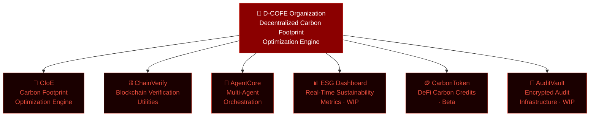

---

## 2. 🔧 Tech Stack Overview

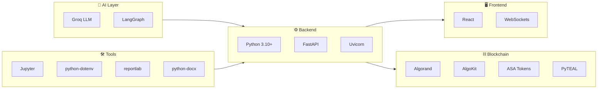

---

## 3. 🌱 CfoE — System Architecture

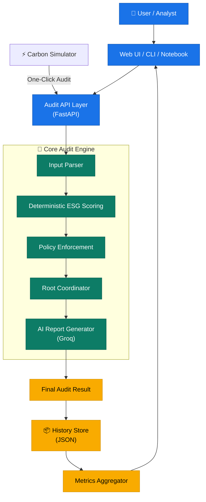

---

## 4. 🔄 CfoE — Audit Flow

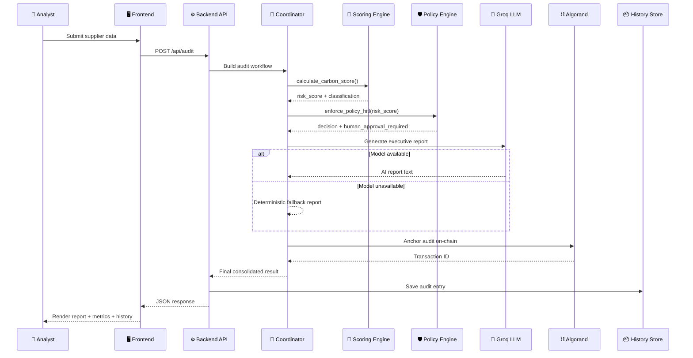

---

## 5. 🤖 Multi-Agent Pipeline

```mermaid
graph LR
    IN["📥 Input\n(Supplier Data)"] --> MON["🔍 Monitor\nAgent"]
    MON --> CALC["🧮 Calculation\nAgent"]
    CALC --> REG["📋 Registry\nAgent"]
    REG --> TRAJ["📈 Trajectory\nAgent"]
    TRAJ --> POL["🛡️ Policy\nAgent"]
    POL --> COORD["🎯 Root\nCoordinator"]
    COORD --> REP["📝 Reporting\nAgent"]
    REP --> OUT["📤 Audit\nOutput"]

    POL -->|High Risk| HITL["🚨 HITL\nSafety Gate\n(Human Review)"]
    HITL --> COORD

    style IN fill:#2c3e50,color:#fff
    style MON fill:#8b0000,color:#fff
    style CALC fill:#8b0000,color:#fff
    style REG fill:#8b0000,color:#fff
    style TRAJ fill:#8b0000,color:#fff
    style POL fill:#c0392b,color:#fff
    style COORD fill:#e74c3c,color:#fff
    style REP fill:#8b0000,color:#fff
    style OUT fill:#2c3e50,color:#fff
    style HITL fill:#f39c12,color:#000
```

---

## 6. ⛓️ Blockchain Integration Flow

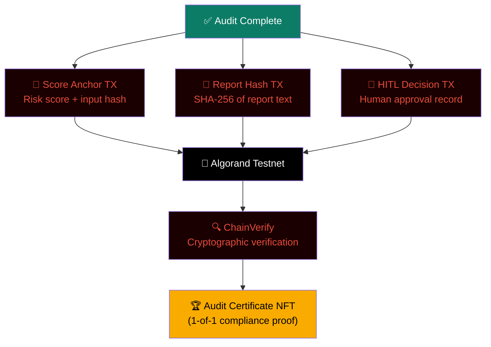

---

## 7. 🪙 CarbonToken — DeFi Flow

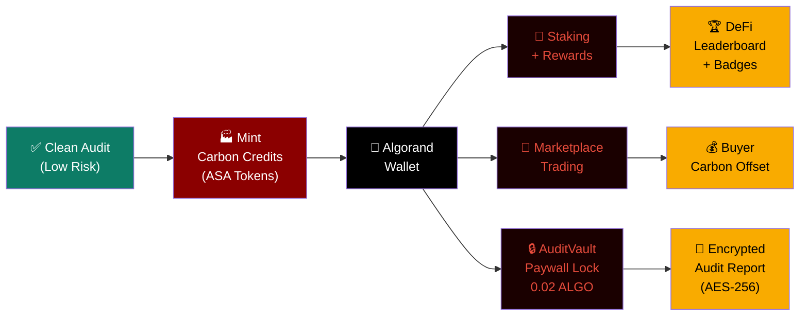

---

## 8. 📁 CfoE — Project Structure

```mermaid
graph TD
    ROOT["📁 cfoe-blockchain/"]

    ROOT --> AGENTS["📁 agents/"]
    ROOT --> ORCH["📁 orchestrators/"]
    ROOT --> WEB["📁 web/"]
    ROOT --> SIM["📁 simulator/"]
    ROOT --> DATA["📁 data/"]
    ROOT --> OUT["📁 outputs/"]
    ROOT --> DOCS["📁 docs/"]
    ROOT --> CORE["📄 Core Files"]

    AGENTS --> A1["calculation_agent.py\n(scoring + pro-rata)"]
    AGENTS --> A2["registry_agent.py\n(entity validation)"]
    AGENTS --> A3["trajectory_agent.py\n(multi-year trends)"]
    AGENTS --> A4["monitor_agent.py"]
    AGENTS --> A5["policy_agent.py"]
    AGENTS --> A6["reporting_agent.py"]

    ORCH --> O1["root_coordinator.py"]

    WEB --> W1["index.html"]
    WEB --> W2["📁 static/\napp.js, styles.css"]

    SIM --> S1["simulator.py\n(port 8000)"]
    SIM --> S2["dashboard.html"]

    CORE --> C1["webapp.py"]
    CORE --> C2["blockchain_client.py"]
    CORE --> C3["main.py"]
    CORE --> C4["global-cfoe.ipynb"]

    style ROOT fill:#8b0000,color:#fff
    style AGENTS fill:#1a0000,color:#e74c3c
    style ORCH fill:#1a0000,color:#e74c3c
    style WEB fill:#1a0000,color:#e74c3c
    style SIM fill:#1a0000,color:#e74c3c
    style DATA fill:#1a0000,color:#e74c3c
    style OUT fill:#1a0000,color:#e74c3c
    style DOCS fill:#1a0000,color:#e74c3c
    style CORE fill:#1a0000,color:#e74c3c
```

---

## 9. 📜 Gazette Compliance — 5 Requirements

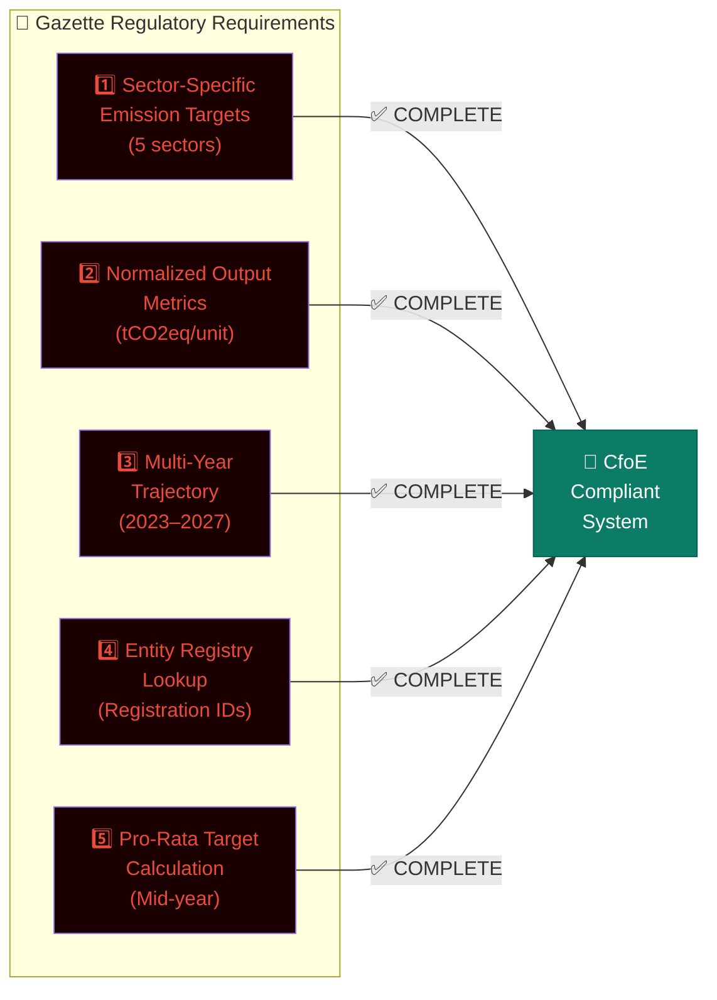

---

## 10. 🎯 Sector Risk Thresholds

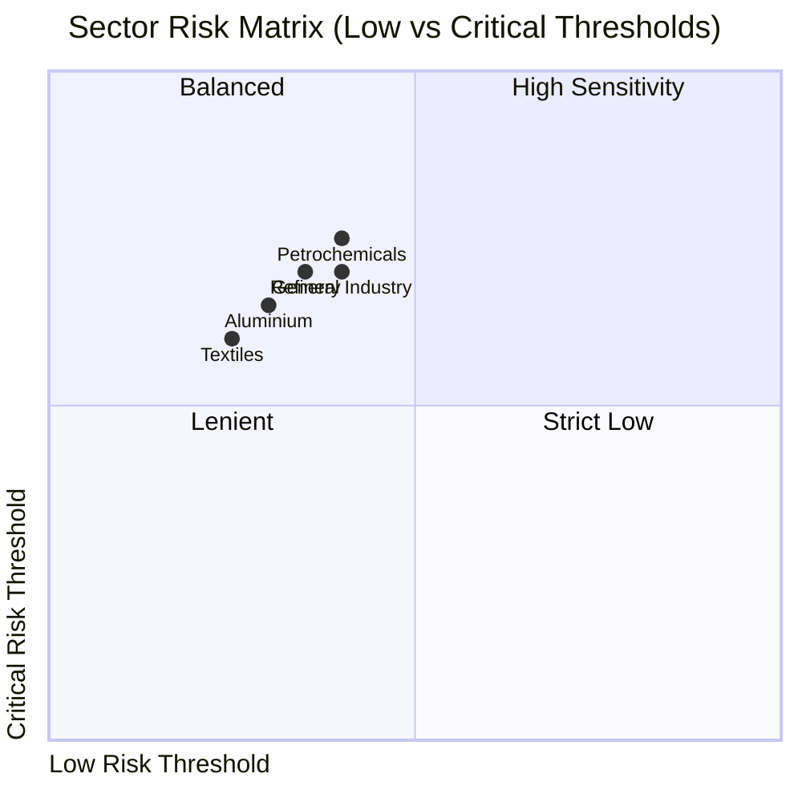

---

## 11. 🔐 AuditVault — Encrypted Paywall Flow

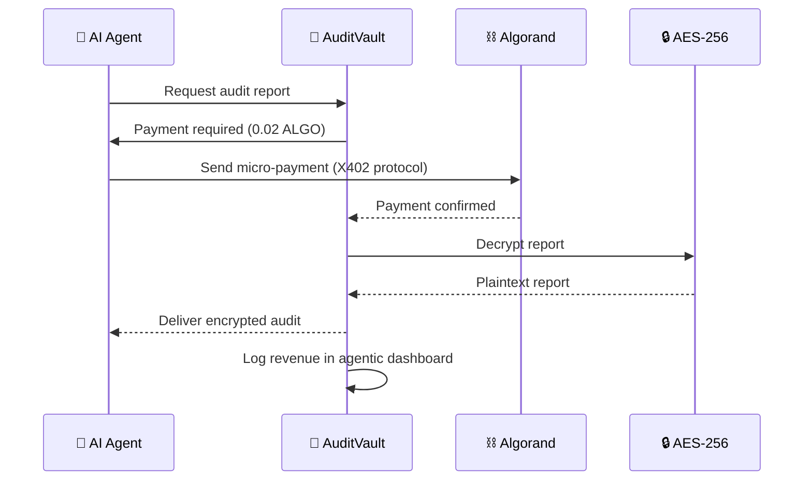

---

## 12. 🌐 Inter-Project Dependency Map

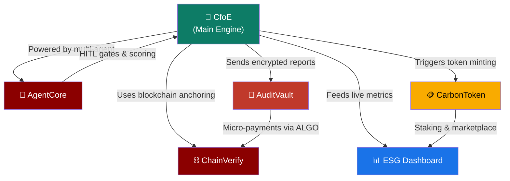

---


<div align="center">

Made with ❤️ by **Team Bankrupts** · Open Source · MIT Licensed

</div>
